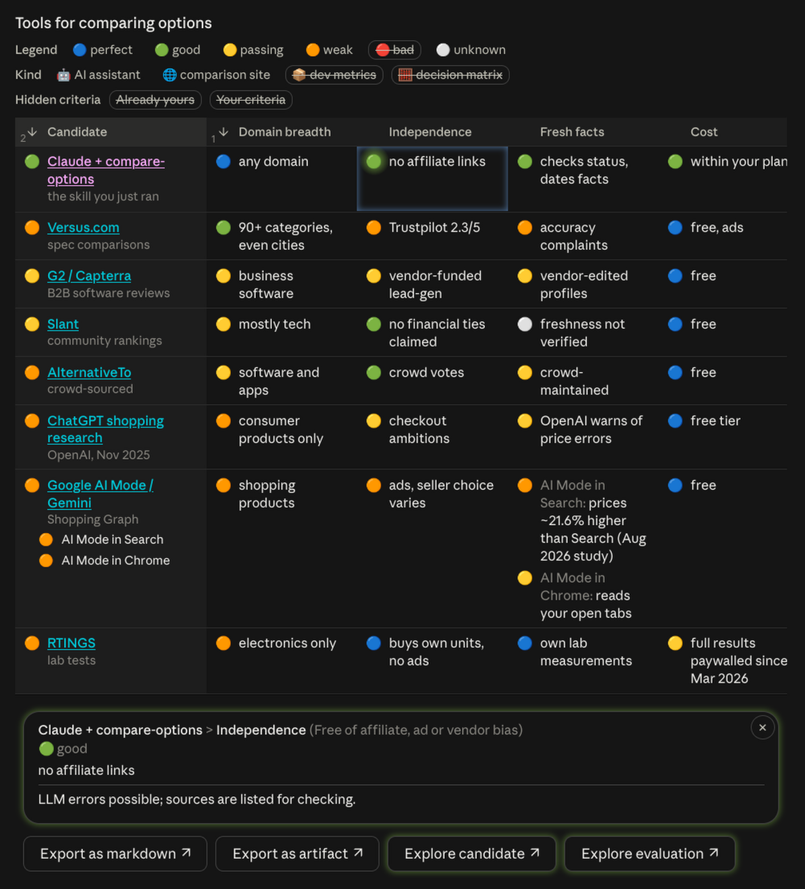

# compare-options

[](https://github.com/cryhot "home page on GitHub")
[](https://agentskills.io "skill format specification")
[](LICENSE "project license")
[](https://github.com/cryhot/agent-skill-compare-options/releases/latest "latest release")
[](https://github.com/cryhot/agent-skill-compare-options/actions/workflows/release.yml "workflow packing the claude.ai zip")
[](https://www.jsdelivr.com/package/gh/cryhot/agent-skill-compare-options "monthly CDN hits of the interactive table")

An agent skill to survey and compare options before choosing or building anything, in any domain:
software tools, libraries, web services, phone apps, hardware, furniture, cars, marketplace skills or extensions.

The agent frames the need (layers, hard and soft constraints), searches wide and checks the current status of each candidate,
rates every candidate on the relevant criteria with one shared scale, then reports the gaps, the ideas worth borrowing, and a recommendation.

| 🔵 | 🟢 | 🟡 | 🟠 | 🔴 | 🟣 | ⚪ | ⚫ |
|---|---|---|---|---|---|---|---|
| perfect | good | passing | weak | bad | incompatible | unknown | irrelevant |

Where the harness can show interactive views, the comparison renders as an interactive table:
sort and reorder criteria, hide marks or criteria, open the details of any rating, move with the arrow keys,
and export the view as markdown or as an artifact.


## Demo

Asked which tools could compare options for us, Claude with this skill produced this table
([open the artifact](https://claude.ai/artifact/TMXFyf9sCnC1FV79GokGcc "interactive table, published as a Claude artifact"),
or read [the whole conversation](https://claude.ai/share/e19f0850-5a79-49b1-82a1-7999eec2401a "shared Claude conversation")):

[](https://cryhot.github.io/agent-skill-compare-options/demo/tools-for-comparing-options.html "open the inline widget")
_The inline widget, as shown in the Claude app.
Open [the widget itself](https://cryhot.github.io/agent-skill-compare-options/demo/tools-for-comparing-options.html), as downloaded from the conversation._


## Install

Clone it into the skills directory of your agent, as `compare-options`: the directory name must match the skill's name.

### Claude Code

```sh
git clone https://github.com/cryhot/agent-skill-compare-options ~/.claude/skills/compare-options
```


### Codex, Gemini CLI, Cursor, GitHub Copilot…

These, and other agents reading the shared `~/.agents/skills` directory:
```sh
git clone https://github.com/cryhot/agent-skill-compare-options ~/.agents/skills/compare-options
```


### opencode

opencode reads both directories above: install the skill in only one of them, or it loads the skill twice.


### claude.ai

[claude.ai](https://claude.ai) has no skills directory:
download [`compare-options.zip`](https://github.com/cryhot/agent-skill-compare-options/releases/latest/download/compare-options.zip) from the latest release,
and upload it in **Customize > Skills**.

> [!IMPORTANT]
> GitHub's **Download ZIP** won't do: its folder is named `agent-skill-compare-options-main`, and [claude.ai](https://claude.ai) needs `compare-options`.


### Update

Run `git pull` in the skill's directory.
On [claude.ai](https://claude.ai), upload the zip of the latest release again.


## Files

- [`SKILL.md`](SKILL.md): the method, read by the agent.
- [`assets/compare-table.html`](assets/compare-table.html): the interactive table template, a wrapper for the data.
- [`assets/compare-table.js`](assets/compare-table.js): the interactive table itself, which the template loads from jsDelivr.
- [`assets/compare-table.md`](assets/compare-table.md): its data format, and what the user can do with it.
- [`demo/`](demo/): a demo of the interactive table, left out of the release zip.


## Development

Serve the repository, then open <http://localhost:8000/demo/>:
```sh
python3 -m http.server 8000
```
The demo renders [`demo/data.js`](demo/data.js) with your local [`assets/compare-table.js`](assets/compare-table.js): reload it after each change.
Add `?widget` to its address to print the prompts the action buttons send, or `?table=1` to load the latest release instead.


## Known limitations

- In the Claude desktop app, the table's action buttons may not reach the chat while the prompt bar has focus.
- The interactive table needs a harness that renders HTML widgets or artifacts; elsewhere, the agent writes markdown tables.


## License

[MIT](LICENSE)
